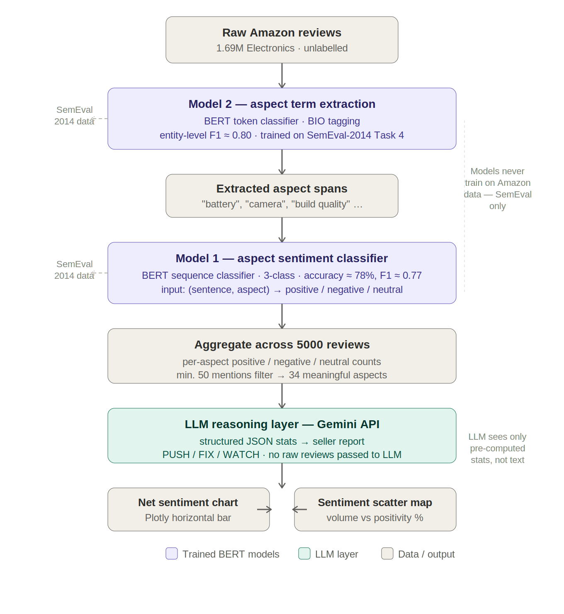

# Amazon Product Review Intelligence: ABSA + LLM Recommendations

Aspect-Based Sentiment Analysis pipeline that reads raw Amazon Electronics reviews and produces a structured seller report — identifying which product aspects customers discuss, what they think about each one, and what a seller should prioritise.

**The problem:** a 3-star average tells a seller nothing useful. It could mean customers love the build quality but hate the software, or love the price but hate the battery. Aspect-level analysis surfaces that distinction.

---

## Pipeline



Two separate models are used because aspect extraction (token classification — one label per word) and sentiment prediction (sequence classification — one label per input pair) are structurally different tasks. Both train exclusively on SemEval-2014 data. The LLM receives only pre-computed statistics — never raw review text — to prevent hallucinated numbers in the report.

---

## Data

| Dataset | Purpose | Source |
|---|---|---|
| SemEval-2014 Task 4 (Laptop) | Training both BERT models | [GitHub mirror](https://github.com/lixin4ever/E2E-TBSA/tree/master/data) |
| Amazon Electronics 5-core | Inference (unlabelled) | [Kaggle — Amazon Electronics Reviews](https://www.kaggle.com/datasets/shivamparab/amazon-electronics-reviews) |

---

## Results

**Model 2 — Aspect Term Extraction**
- Entity-level F1 ≈ **0.80** on SemEval held-out test set (scored with `seqeval`)
- Switching checkpoint selection from validation loss to seqeval F1 was the single most impactful change — loss is a poor proxy when the `O` tag dominates every sentence

**Model 1 — Aspect Sentiment Classifier**
- Accuracy ≈ **78%**, weighted F1 ≈ **0.77** on SemEval held-out test set
- Negative/positive both score ~0.81–0.83 F1; neutral lower at ~0.58, expected given fewer training examples and inherent label ambiguity

**Pipeline output on Amazon data**
- 5000 reviews → 34 meaningful aspects after filtering (min. 50 mentions)
- Price: 90% positive across 684 mentions — strongest signal
- Software, volume, router, power: clearest FIX priorities by net negative sentiment

---

## Future Work

- Expand training data beyond SemEval's single-domain laptop reviews to include multi-domain ABSA datasets (restaurants, electronics, phones) — the limited data size and domain narrow-ness is likely the root cause of both sentiment leakage and weaker neutral class performance
- Train on labelled data from multiple review platforms (Amazon, Yelp, Google Reviews) to improve generalisation across writing styles, since SemEval's academic annotation style differs significantly from real-world user-generated text
- Fine-tune on a small labelled Amazon Electronics sample to close the domain gap between SemEval's academic laptop reviews and real-world Amazon phrasing
- Scale inference to the full 100k review sample for statistically meaningful coverage of lower-frequency aspects

---

## Setup

```bash
pip install -r requirements.txt
```

Set your Gemini API key in Colab Secrets (key icon in left sidebar) under the name `GEMINI_API_KEY` before running Section 11.

---

## Stack

`transformers` · `torch` · `seqeval` · `scikit-learn` · `pandas` · `plotly` · Google Gemini API

---

## Files

| File | Description |
|---|---|
| `absa_amazon_reviews_pipeline.ipynb` | Full pipeline, runnable end-to-end in Google Colab |
| `pipeline.png` | End-to-end architecture diagram |
| `requirements.txt` | Python dependencies with pinned versions |
| `README.md` | This file |

---

## License

The SemEval-2014 dataset is used for research purposes under its original release terms. The Amazon Electronics dataset is sourced from [Kaggle](https://www.kaggle.com/datasets/shivamparab/amazon-electronics-reviews) and used for non-commercial academic use.
